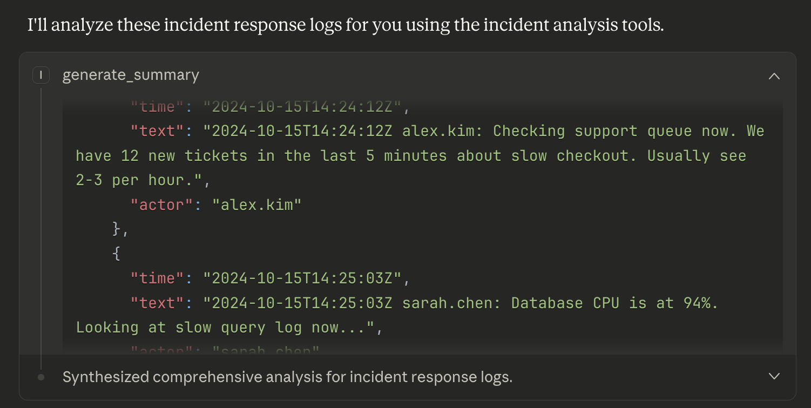
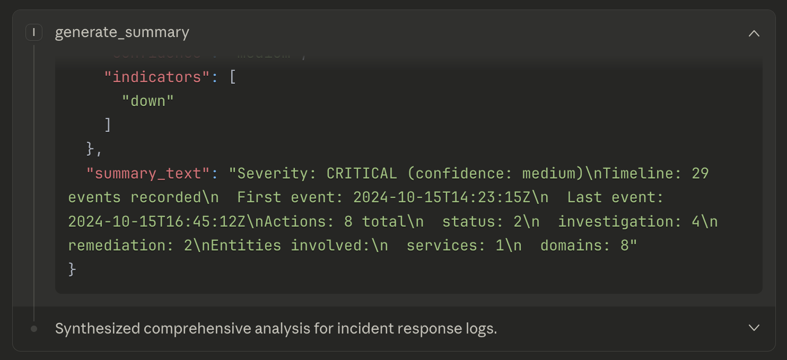

# Incident Timeline Extractor MCP Server

> **Note:** This is a small learning project built to explore MCP server development, not production-ready incident management software.

An simple MCP (Model Context Protocol) server that extracts structured information from incident response logs. Built to help analyze chat-based incident communications (Slack, Discord, etc.) by automatically identifying timelines, actions, severity, and involved systems.

## What It Does

Transforms unstructured incident logs into structured data:
```
@sarah 14:23: payment-service down, error rate at 15%
@mike 14:25: rolling back deploy
@sarah 14:30: service restored
```

**Extracts:**
- **Timeline**: Chronological events with timestamps and actors
- **Actions**: Categorized response actions (investigation, remediation, communication)
- **Entities**: Services, IP addresses, domains involved
- **Severity**: Incident severity level with confidence scoring

## Demo

**See it in action:** [Full conversation with Claude using the MCP tools →](https://claude.ai/share/ef47cf8c-48ef-4cee-a1cd-958b00aa2ce4)

### Example: Analyzing a Real Incident

**Input:** [`examples/incident_response_simple.txt`](examples/incident_response_example.txt) - Database performance incident with ISO 8601 timestamps

**Output:** [`examples/incident_response_output.json`](examples/incident_response_output.json) - Complete structured extraction

The server extracts:
- **29 timeline events** over 2+ hours (14:23 → 16:45)
- **8 categorized actions** (investigation, remediation, communication, status)
- **Entities involved:** checkout-service, GitHub.com, company.atlassian.net
- **Severity assessment:** Critical level with indicator analysis

**Key screenshots:**

*Timeline extraction with timestamps and actor detection*


*Severity assessment and human-readable summary*

The server extracts:
- **29 timeline events** over 2+ hours
- **8 categorized actions** (investigation, remediation, communication, status)
- **Entities involved:** checkout-service, multiple domains, and infrastructure
- **Severity assessment:** Critical with confidence scoring

[View complete tool output →](https://claude.ai/share/ef47cf8c-48ef-4cee-a1cd-958b00aa2ce4)

## Installation
```bash
# Clone the repository
git clone https://github.com/ian-de-marcellus/incident-timeline-mcp
cd incident-timeline-mcp

# Set up virtual environment
python -m venv venv
source venv/bin/activate  # On Windows: venv\Scripts\activate

# Install dependencies
pip install -r requirements.txt

# Run tests
pytest tests/ -v
```

## Configuration

Add to your Claude Desktop config (`~/Library/Application Support/Claude/claude_desktop_config.json`):
```json
{
  "mcpServers": {
    "incident-timeline": {
      "command": "/absolute/path/to/venv/bin/python",
      "args": ["/absolute/path/to/server.py"]
    }
  }
}
```

Restart Claude Desktop, and the tools will be available!

## Available Tools

### 1. `extract_timeline`
Extracts chronological events with timestamps and actors.

**Input:** Incident text  
**Output:** List of events with `time`, `text`, `actor`

### 2. `identify_actions`
Identifies and categorizes actions taken during response.

**Categories:** investigation, remediation, communication, status  
**Output:** List with `action`, `category`, `context`

### 3. `extract_entities`
Finds systems, services, and infrastructure mentioned.

**Output:** Dict with `services`, `ips`, `domains` lists

### 4. `detect_severity`
Assesses incident severity from keywords and context.

**Output:** `level` (critical/high/medium/low), `confidence`, `indicators`

### 5. `generate_summary`
Comprehensive report combining all extractors.

**Output:** All of the above plus formatted summary text

## Technical Details

### Architecture
```
patterns.py       → Regex patterns and keyword lists
extractors.py     → Core extraction logic with context filtering
server.py         → MCP server exposing tools to Claude
tests/            → Comprehensive test suite
```

### Key Design Decisions

**Pattern Extraction with Context Filtering**
- Regex patterns match broadly (e.g., any `HH:MM` format)
- Context analysis filters false positives (e.g., "ratio of 3:45")
- Balances recall vs. precision for real-world logs

**Timestamp Support**
- ISO 8601: `2024-10-15T14:23:15Z`
- Full datetime: `2024-10-15 14:23:45`
- Simple time: `14:23` or `14:23:45`

**Actor Recognition**
- `@mentions` (Slack/Discord style)
- `Name:` format (chat logs)
- `firstname.lastname:` format (common in engineering teams)
- Filters common false positives (Error:, Status:, domain names)

**Severity Detection**
- Keyword-based scoring across 4 levels
- Confidence based on indicator count
- Flexible matching: "error rate", "jumped", "spike"

### Testing Approach

Comprehensive test coverage using pytest:
- **Pattern tests**: Validates regex behavior, documents known limitations
- **Extractor tests**: Unit tests for each function + integration tests
- **Edge cases**: Empty input, whitespace, false positives, mixed formats

Known limitations documented with `@pytest.mark.xfail`:
- Names with particles (von, de, van) not captured
- Ambiguous patterns require context filtering
- Some severity indicators may be missed

```bash
# Run all tests
pytest tests/ -v

# Run specific test file
pytest tests/test_extractors.py -v

# See test coverage
pytest tests/ -v --cov=extractors --cov=patterns
```

## Example Incident Formats

The extractor handles various log formats:

**Simple format:**
```
@sarah 14:23: Issue detected
@mike 14:25: Fix deployed
```

**ISO 8601 timestamps:**
```
2024-10-15T14:23:15Z sarah.chen: Database CPU at 94%
2024-10-15T14:25:03Z mike.jones: Rolling back deploy
```

**Mixed formats:**
```
System: Health check failed at 14:29
@alice 14:30: Manually restarted service
2024-10-15T14:35:00Z Status: All services responding
```

## Development

### Running Locally
```bash
# Activate virtual environment
source venv/bin/activate

# Run tests with verbose output
pytest tests/ -v

# Test a specific extractor
python -c "
from extractors import extract_timeline
text = '@sarah 14:23: Test event'
print(extract_timeline(text))
"

# Run the MCP server directly (for debugging)
python server.py
```

### Project Structure
```
incident-timeline-mcp/
├── extractors.py           # Core extraction functions
├── patterns.py             # Regex patterns and keywords
├── server.py               # MCP server implementation
├── requirements.txt        # Python dependencies
├── tests/
│   ├── test_patterns.py    # Pattern validation tests
│   ├── test_extractors.py  # Extractor unit/integration tests
│   └── test_server.py      # Server smoke tests
└── examples/
    ├── sample_incident.txt # Simple example
    └── incident_response_simple.txt # Realistic example
```

## Future Enhancements

Potential improvements for v2:
- [ ] Automatic timeline sorting by timestamp
- [ ] Duration calculation for incidents
- [ ] Actor mention resolution (map @handles to full names)
- [ ] Machine learning for severity classification
- [ ] Support for additional log formats (JSON, structured logs)
- [ ] Entity relationship mapping (which actor worked on which service)
- [ ] Leverage Claude integration for more flexible analysis
- [ ] Export to incident report templates

## Why This Project?

A hands-on learning project built in an evening to explore MCP server development. While the problem (extracting structure from incident logs) is real, this is **intentionally scoped as a portfolio piece** rather than production software.

**Demonstrates:**
- **MCP integration**: Practical AI tooling with Claude
- **Clean architecture**: Separation of patterns, logic, and server
- **Test-driven development**: Comprehensive test suite with documented limitations
- **Real-world problem**: Incident response timeline analysis is genuine IR work
- **Production thinking**: Context filtering, error handling, edge case management

**Intentionally omitted** (would be required for production):
- Authentication and authorization
- Database persistence
- Real-time log streaming
- Slack/PagerDuty/Jira integrations
- Multi-tenant support
- Compliance and audit logging

The goal was learning MCP, demonstrating testing practices, and building something functional in a constrained timeframe—not competing with established incident management platforms.

## License

MIT

## Author

Built by Ian de Marcellus and Claude Sonnet 4.5 as a portfolio project demonstrating MCP server development, pattern recognition, and systematic testing approaches.