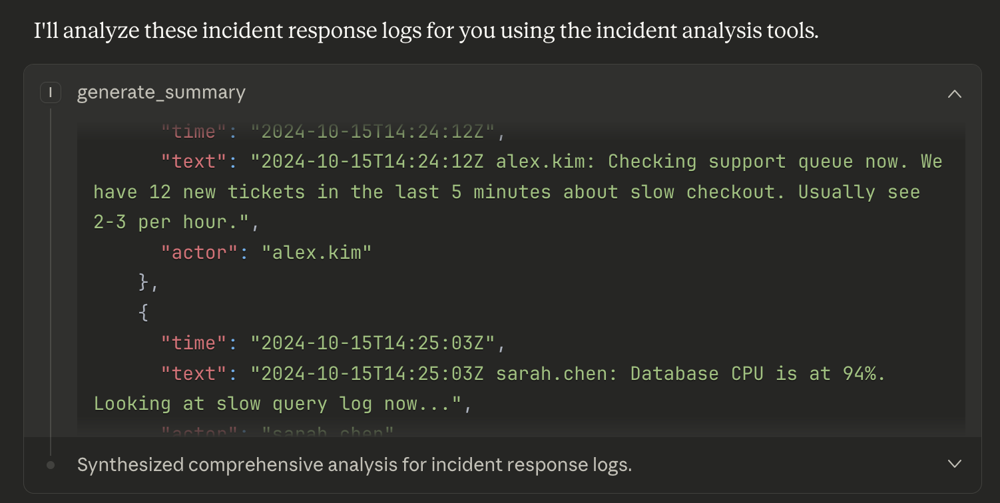
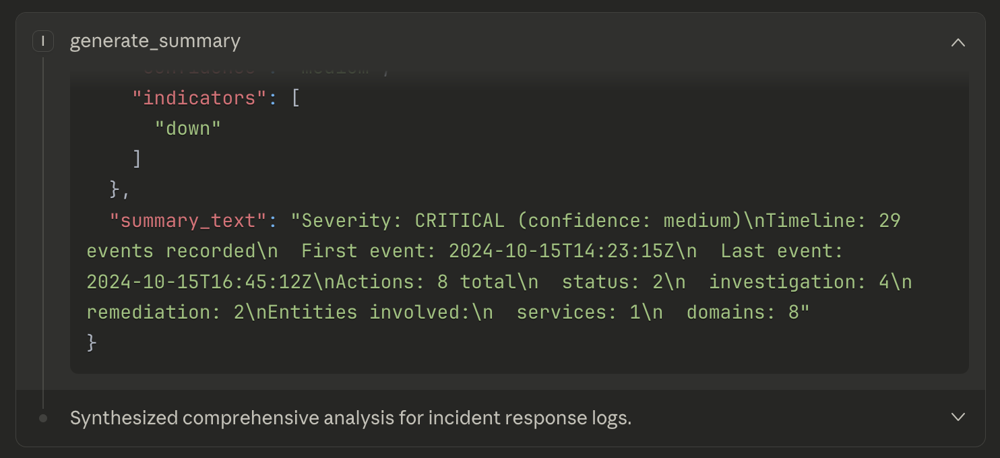

# Incident Timeline MCP Server

An MCP server that extracts structured incident analysis from raw communication logs. Feed it a Slack export or plaintext chat log and it produces a timeline classified by [NIST SP 800-61](https://csrc.nist.gov/pubs/sp/800-61/r2/final) incident response phases, severity assessment, responder metrics, and identified entities — using regex extraction where deterministic patterns suffice and Claude Haiku for semantic classification where they don't.

## Example: Phishing Incident from Slack Export

**Input:** A [Slack workspace export](examples/phishing-export/) from a security ops channel — 12 messages including bot alerts from Splunk, Okta, and Google Workspace.

**Output:**

```
=== SUMMARY ===
Severity: CRITICAL (confidence: medium)
IR Phases: Detection (13:20-13:25) -> Analysis (13:21-13:26) -> Containment (13:22-13:26)
           -> Eradication (13:27-13:30) -> Post-Incident (13:31)
Duration: 11m
Incident duration: 6m
Time to contain: 2m
Responders: 6
Timeline: 10 events recorded
Actions: 13 total
  investigation: 4, communication: 3, remediation: 5, status: 1
Entities: 175.45.176.10, secure-payroll-update.com

=== TIMELINE ===
  [detection]    13:20  sarah.helpdesk  Phishing reports from Sales — emails from admin@secure-payroll-update.com
  [analysis]     13:21  mike.sec        Checking mail logs. Domain is external.
  [containment]  13:22  mike.sec        Confirmed phishing. Blocking domain at gateway.
  [detection]    13:25  Splunk          CRITICAL: Impossible travel — john.doe from Pyongsong, KP (175.45.176.10)
  [containment]  13:25  alex.ciso       Compromised executive account. Full lockdown.
  [containment]  13:26  Okta            john.doe suspended by mike.sec — Security Incident.
  [analysis]     13:26  mike.sec        Session revoked. Password reset. Investigating lateral movement.
  [eradication]  13:27  mike.sec        Purging phishing email from all 45 inboxes.
  [eradication]  13:30  Google Wksp     Bulk deletion complete — 45 messages removed.
  [post_incident] 13:31  alex.ciso      Starting post-mortem doc.

=== METRICS ===
  Events: 10 (2 noise messages filtered)    Responders: 6
  Duration: 11m    Incident duration: 6m    Time to contain: 2m
```

The raw Slack export contained 12 messages including off-topic chatter. The tool filtered noise, resolved user IDs to display names, extracted bot alert content from attachments, and classified each event into an IR phase. Regex handled timestamps, entities, and action keywords; Haiku refined the phase classifications and flagged irrelevant messages.

## How It Works

```
  Slack JSON / plaintext
          │
          ▼
  ┌──────────────┐     ┌──────────────┐
  │   Parsers    │────▶│  Extractors  │──── regex: timestamps, actors, actions,
  │ slack.py     │     │ extractors.py│      entities, severity keywords
  │ (plaintext)  │     │ patterns.py  │
  └──────────────┘     └──────┬───────┘
                              │
                     low confidence?
                              │
                              ▼
                    ┌──────────────────┐
                    │  LLM Enrichment  │──── Haiku: phase classification,
                    │ llm/enrichment.py│      severity, actions, entity
                    └──────┬───────────┘      disambiguation
                           │
                           ▼
                    ┌──────────────┐
                    │   Analysis   │──── IR phase mapping, severity timeline,
                    │              │      incident metrics (TTC, TTR)
                    └──────────────┘
```

**Regex first, LLM where needed.** Deterministic extraction handles timestamps, actor resolution, entity detection, and keyword matching. Claude Haiku runs only on low-confidence classifications — phase assignment, severity in context, and entity disambiguation (is `sarah.chen` a person or a domain?). Because only a handful of targeted API calls are made per run (not the full document), enrichment currently costs roughly $0.01 for a short incident — though this isn't guaranteed and will vary with input size. The tool works without an API key; LLM enrichment improves accuracy but isn't required.

**NIST SP 800-61 framework.** Events are classified into Detection, Analysis, Containment, Eradication, Recovery, and Post-Incident phases. Regex assigns initial phases based on keyword signals and position; Haiku refines low-confidence assignments using semantic context.

## Quick Start

> **Note:** This is a small learning project built to explore MCP server development, not production-ready incident management software.

A simple MCP (Model Context Protocol) server that extracts structured information from incident response logs. Built to help analyze chat-based incident communications (Slack, Discord, etc.) by automatically identifying timelines, actions, severity, and involved systems.

## What It Does

Transforms unstructured incident logs into structured data:
```
@sarah 14:23: payment-service down, error rate at 15%
@mike 14:25: rolling back deploy
@sarah 14:30: service restored
```

**Extracts:**
- **Timeline**: Chronological events with timestamps and actors
- **Actions**: Categorized response actions (investigation, remediation, communication)
- **Entities**: Services, IP addresses, domains involved
- **Severity**: Incident severity level with confidence scoring

## Demo

**See it in action:** [Full conversation with Claude using the MCP tools →](https://claude.ai/share/ef47cf8c-48ef-4cee-a1cd-958b00aa2ce4)

### Example: Analyzing a Real Incident

**Input:** [`examples/incident_response_simple.txt`](examples/incident_response_example.txt) - Database performance incident with ISO 8601 timestamps

**Output:** [`examples/incident_response_output.json`](examples/incident_response_output.json) - Complete structured extraction

The server extracts:
- **29 timeline events** over 2+ hours (14:23 → 16:45)
- **8 categorized actions** (investigation, remediation, communication, status)
- **Entities involved:** checkout-service, GitHub.com, company.atlassian.net
- **Severity assessment:** Critical level with indicator analysis

**Key screenshots:**

*Timeline extraction with timestamps and actor detection*


*Severity assessment and human-readable summary*

## Installation
```bash
git clone https://github.com/ian-de-marcellus/incident-timeline-mcp
cd incident-timeline-mcp
python -m venv venv
source venv/bin/activate
pip install -r requirements.txt
pytest tests/ -q   # 564 tests, ~4s
```

### Connect to Claude Desktop

Add to `~/Library/Application Support/Claude/claude_desktop_config.json`:

```json
{
  "mcpServers": {
    "incident-timeline": {
      "command": "/absolute/path/to/venv/bin/python",
      "args": ["/absolute/path/to/server.py"]
    }
  }
}
```

### Try It

Once connected, ask Claude:

> Analyze the phishing incident resource.

Claude will discover the `incident://examples/phishing-export` resource and call `analyze_resource` to run the full pipeline — parsing the Slack export, resolving user IDs, filtering noise, classifying IR phases, and returning a structured incident report. No copy-pasting required.

All 7 sample resources work the same way. For example:

> Analyze the multi-day company export.

> What's the severity of the simple incident?

### Optional: Enable LLM Enrichment

Create a `.env` file in the project root:

```
ANTHROPIC_API_KEY=sk-ant-...
LLM_ENRICHMENT=regular   # none | low | regular
```

Without this, the tool runs regex-only — still functional, just lower accuracy on phase classification.

## MCP Interface

### Tools

| Tool | Input | Output |
|------|-------|--------|
| `analyze_resource` | Resource URI | Reads a sample incident resource and runs the full pipeline automatically |
| `generate_summary` | Incident text | Full analysis: timeline, actions, entities, severity, IR phases, metrics |
| `parse_slack_export` | Slack JSON (messages + optional users) | Same as above, plus Slack metadata (noise filtered, thread count) |
| `extract_timeline` | Incident text | Chronological events with timestamps, actors, IR phases |
| `identify_actions` | Incident text | Categorized actions (investigation, remediation, communication, status) |
| `extract_entities` | Incident text | Services, IP addresses, domains |
| `detect_severity` | Incident text | Severity level, confidence, indicators |
| `map_to_framework` | Incident text | NIST 800-61 phase mapping with metrics |

### Resources

The server exposes sample incidents that Claude can discover and read:

| URI | Description |
|-----|-------------|
| `incident://examples/simple` | Payment-service incident, plaintext (11 events) |
| `incident://examples/detailed` | Database performance incident, plaintext (30 events, 5 responders) |
| `incident://examples/slack-export` | Slack workspace export with bot messages (18 messages) |
| `incident://examples/phishing-export` | Phishing attack with executive account compromise (12 messages) |
| `incident://examples/coinflux-export` | Database migration locks causing API latency (12 messages) |
| `incident://examples/company-export` | Multi-day memory leak incident across 5 days (24 messages) |
| `incident://examples/security-export` | DDoS escalating to account compromise, cross-year (8 messages) |

## Project Structure

```
incident-timeline-mcp/
├── server.py               # MCP server — tools + resources
├── extractors.py           # Core pipeline — extraction, analysis, formatting
├── patterns.py             # Regex patterns and keyword lists
├── models.py               # Data models (AnalysisState, IncidentReport, etc.)
├── config.py               # Settings (API key, enrichment level)
├── parsers/
│   └── slack.py            # Slack export parser (user resolution, mrkdwn, attachments)
├── llm/
│   ├── enrichment.py       # Haiku integration — phase, severity, action, entity passes
│   └── prompts.py          # Tool schemas and system prompts for each enrichment pass
├── tests/                  # 564 tests — patterns, extractors, LLM (mocked), server, e2e
├── examples/               # Sample incidents (plaintext + Slack exports)
└── docs/
    └── architecture-v2.md  # Detailed architecture and design decisions
```

## Design Decisions

See [`docs/architecture-v2.md`](docs/architecture-v2.md) for the full architecture document. Key choices:

- **Dependency injection** — LLM client is constructed at the boundary (`server.py`, `generate_summary`), passed through the pipeline. Tests run fast with no API calls.
- **Graceful degradation** — No API key? Regex-only results. API call fails? That enrichment pass is skipped, others continue.
- **Slack-native parsing** — User ID resolution, bot message attribution, attachment text extraction, mrkdwn cleanup, noise filtering, multi-day export support.
- **Hybrid confidence model** — Each phase classification carries a confidence level (`high`/`medium`/`low`) and source (`regex`/`llm`). Low-confidence regex assignments are candidates for LLM refinement.

## License

MIT

## Author

Built by Ian de Marcellus and Claude Sonnet 4.5 as a portfolio project demonstrating MCP server development, pattern recognition, and systematic testing approaches.
